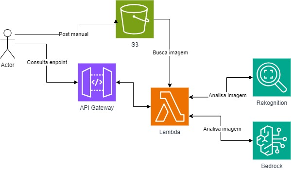

<h1 align="center">Desenvolvimento de APIs Serverless para Análise de Imagens com Serviços AWS</h1>
<h2 align="center">Implementação de Rotas para Análise de Emoções Humanas e Identificação de Animais e Raças Utilizando Amazon Rekognition e Monitoramento com Amazon CloudWatch</h2>


[](https://aws.amazon.com/)
[](https://www.python.org/)
[](https://www.serverless.com/)

## 📌 Índice
1. [Objetivo do Projeto](#-objetivo-do-projeto)
2. [Desenvolvimento do projeto](#-desenvolvimento)
3. [Estrutura de pastas](#-estrutura-de-pastas)
4. [Arquitetura AWS](#️-arquitetura-aws)
5. [Como usar o sistema](#-como-instalar-e-usar-o-sistema)
6. [Tecnologias utilizadas](#-tecnologias-utilizadas)
7. [Dificuldades encontradas](#️-dificuldades-encontradas)
8. [Trabalhos Futuros](#-trabalhos-futuros)
9. [Autores](#-autores)

## 📖 Objetivo do Projeto
Criar APIs, com o framework "serverless", que utiliza os serviços Amazon Rekognition para análise de imagens, Amazon Bedrock para geração de conteúdo baseado em IA e Amazon CloudWatch para monitoramento e registro de logs.

## 🎯 Desenvolvimento

A aplicação foi desenvolvida utilizando o framework serverless para criar duas rotas para a nossa API que irão rodar o Amazon Rekognition para extrair tags de imagens postadas no s3 e o Amazon Bedrock para gerar conteúdo. 

Parte 1: Foram implementadas as especificações pediddas. Upload manual de imagens para o s3, definição do bounding box das faces encontradas e a emoção principal classificada pelo modelo.

Parte 2: Foram implementadas as especificações pediddas. Da mesma forma, upload manual de imagens para o s3. Depois, é feita uma chamada do Rekognition para identificação de labels e, caso seja encontrada uma face, fazemos uma segunda chamada ao Rekognition para indentificar os features e emoções da face, por fim, utilizamos o Bedrock para gerar dicas sobre a(s) raça(s) do pet encontrado nos labels.

## 📂 Estrutura de pastas
 
```md
sprint-8-pb-aws-abril
├── assets
├── src
│   ├── visao-computacional
│   |   ├── errors
│   |   │   ├── __init__.py
│   |   │   ├── bad_request_errors.py
│   |   │   ├── base_error.py
│   |   │   └── internal_server_error.py
│   |   ├── handlers
│   |   │   ├── __init__.py
│   |   │   ├── create_response.py
│   |   │   ├── handle_bad_request.py
│   |   │   └── handle_internal_server_error.py
│   |   ├── rekognition
│   |   │   ├── __init__.py
│   |   │   ├── rekognition_image_detection.py
│   |   │   └── rekognition_objects.py
│   |   ├── routes
│   |   │   ├── __init__.py
│   |   │   ├── health.py
│   |   │   ├── v1_description.py
│   |   │   ├── v1_vision.py
│   |   │   ├── v2_description.py
│   |   │   └── v2_vision.py
│   |   ├── tests
│   |   │   ├── test_errors.py
│   |   │   ├── test_handlers.py
│   |   │   └── test_utils.py
│   |   └── utils
│   |       ├── __init__.py
│   |       ├── bedrock.py
│   |       ├── labels.py
│   |       ├── parse_body.py
│   |       └── v1_response.py
|   ├── conftest.py
|   ├── serverless.yml
|   └── .env.example
├── .gitignore
├── images.md
└── README.md
```


## 🏗️ Arquitetura AWS


## 🚀 Como instalar e usar o sistema

1. Verifique se vc tem o python instalado. Mais informações [aqui](https://www.python.org/) 

2. Instale o framework serverless em seu computador. Mais informações [aqui](https://www.serverless.com/framework/docs/getting-started)

```bash
npm install -g serverless
```

3. Gere suas credenciais (AWS Acess Key e AWS Secret) na console AWS pelo IAM. Mais informações [aqui](https://www.serverless.com/framework/docs/providers/aws/guide/credentials/)

4. Depois de clonado o repo e instaldo o serverless, temos que navegar para a pasta da api:

```bash
git clone htt://.....
cd sprint-8-pb-aws-abril
```

5. Instalr os plugins para rodar o projeto em modo local:

```bash
cd src/visao-computacional
serverless plugin install -n serverless-dotenv-plugin
```

6. Nessa altura, é preciso configurar o seu arquivo .env. Crie um arquivo .env no foler visao-computacional, onde se encontra o arquivo .evn.example.
Preencha com os dados do seu env.

7. Com o env configurado, podemos agora rodar em modo local e testar os nossos endpoints:

- Para testar uma rota específica, por exemplo:

```bash
serverless invoke local --function hello
```
- Para fazer o deploy do projeto:

```bash
serverless deploy
```

- Para fazer o deploy e ver as informações adicionais:

```bash
serverless deploy --verbose
```

- Para fazer o deploy de uma função específica, por exemplo:

```bash
serverless deploy function -f functionName
```

8. Para rodar os testes unitários:

```bash
pytest tests/*.py -v -s
```

## 🔎 Nossas rotas

É possível utilizar nosso sistema em produção a partir dessas rotas utilizando, por exemplo, o Postman:

**https://jntnuwkzuj.execute-api.us-east-1.amazonaws.com/v1/vision**

JSON de exemplo para post:
```json
{  
   "bucket": "vision-image-files-bucket",  
   "imageName": "two-faces.jpg"  
} 
```

**https://jntnuwkzuj.execute-api.us-east-1.amazonaws.com/v2/vision**

```json
{  
   "bucket": "vision-image-files-bucket",  
   "imageName": "dog.jpg"  
} 
```

Ou utilizando o comando curl:

```bash
curl -i -X POST -H 'Content-Type: application/json' -d '{"bucket": "vision-image-files-bucket", "imageName": "two-faces.jpg"}' https://jntnuwkzuj.execute-api.us-east-1.amazonaws.com/v1/vision
v1/vision
```

```bash
curl -i -X POST -H 'Content-Type: application/json' -d '{"bucket": "vision-image-files-bucket", "imageName": "dog.jpg"}' https://jntnuwkzuj.execute-api.us-east-1.amazonaws.com/v1/vision
v2/vision
```

[**Lista de imagens por rotas**](images.md)

## 💻 Tecnologias utilizadas

### AWS
- **S3:** utilizado para armazenar as imagens que serão analisadas pelo Amazon Rekognition. As imagens são carregadas manualmente no bucket especificado e os URLs são usados nas requisições da API.
- **CloudWatch:** utilizado para registrar os logs das chamadas das funções Lambda.
- **Amazon Rekognition:** utilizado para detectar e analisar as emoções nas faces presentes nas imagens. Também foi utilizado para identificar a presença de pets.
- **Amazon Bedrock:** utilizado para gerar conteúdo com base nas informações obtidas pelo Rekognition. Quando um pet é detectado na imagem, o Bedrock gera dicas relacionadas ao pet, incluindo nível de energia, necessidades de exercícios, temperamento, cuidados e problemas de saúde comuns.

### Geral
- **Python:** a aplicação foi desenvolvida em Python, seguindo a estrutura base disponibilizada. Utilizamos bibliotecas específicas para integração com os serviços AWS.
- **Postman:** utilizado para testar as rotas da API. Foram realizados testes para garantir que as rotas GET e POST retornassem os resultados esperados, conforme especificado.
- **Framework Serverless:** utilizado para gerenciar a infraestrutura como código. Através do Serverless, foi possível configurar e fazer o deploy das funções Lambda e dos recursos necessários na AWS.
- **Boto3:** utilizada como AWS SDK para Python, facilitando a comunicação entre o código Python e os serviços AWS. Foi utilizada para interagir com o S3, Rekognition e CloudWatch.


## 🛠️ Dificuldades encontradas

- Respostas inconsistentes do Bedrock no caso de mais de uma raça encontrada. As vezes ele da dicas sobre as duas, as vezes ele da dica sobre uma só.

- Impossibilidade de quebra de linhas , '\n', na resposta do JSON.

- Retorno quando não encontrada a face. No python é utilizado o None para representar um objeto nulo. Quando os retornos do JSON são setados como None, a configuração final seria algo como `"Height": null` e não `"Height": Null`. Optamos por utilizar o None ao invés de setar o atributo do JSON para uma string "Null".

## ⚙ Trabalhos futuros

- Implementar uma melhor forma de filtragem e seleção de raças encontradas, talvez o uso de collections.

- Terminar e finalizar o deploy do frontend.

- Entendemos que o upload manual é requisito da entrega, mas gostaríamos de implemetar o upload de usuários pelo frontend/rota. Também achamos que seria interessante adequar o status code retornado.

- Adicionar completamente type annotation.

- Refactor da rota v2_vision

## ✍🏻 Autores
- [Pâmela Aliny Cleto Pavan](https://github.com/PamelaPavan)

